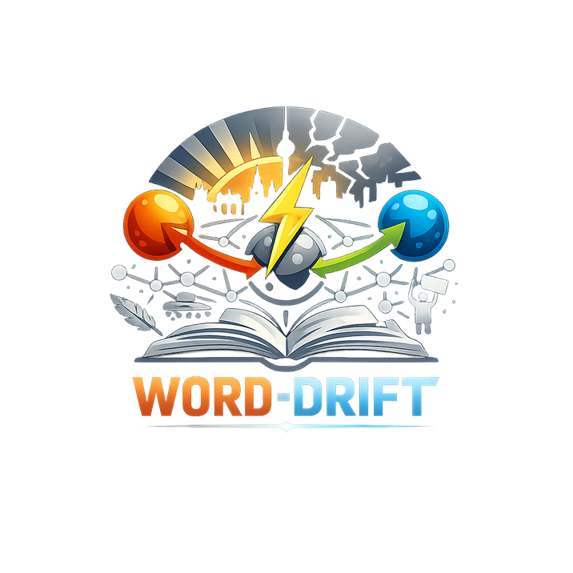

# word-drift-on-trails

<p align="center">
  
</p>

**The [Trails](https://github.com/XORwell/trails) port of [WORD-DRIFT](https://github.com/XORwell/word-drift) — a live knowledge-graph API for lexical semantic change, served from an Oxigraph triple store with SPARQL, provenance, and SHACL validation built in.**

---

> ### Word Drift 3.0 — M0–M8 landed on `feat/word-drift-3.0`
>
> This branch extends the model from **Time → Drift** to
> **Time × Group × Geography × Platform × Emotion × Context → Meaning Distribution**.
>
> All eight milestones from [`docs/plans/word-drift-3.0/05-milestones.md`](docs/plans/word-drift-3.0/05-milestones.md) are shipped:
>
> | Milestone | Deliverable |
> |-----------|-------------|
> | M0 | Plan tree, 5 ADRs, ontology stubs (modules 08–12) |
> | M1 | `Group` / `Community` / `MeaningAttribution` Python wiring + SHACL + CQ13 |
> | M2 | Curated Querdenker × 5 groups × 5 years multi-group dataset |
> | M3 | `semantic_entropy`, `semantic_fragmentation_index`, `group_divergence` metrics + REST + tests |
> | M4 | `/graph-distribution.json` + Distribution tab on `explore.html` (summary card, sparklines, per-group small multiples) |
> | M5 | `Region` + proportional-symbol map (US/UK/DE on `woke`) |
> | M6 | `Platform` / `CorpusContext` / `Register` + `cross_platform_distance` JSD + platform sub-panel |
> | M7 | `EmotionalFraming` + per-group valence heatmap + `emotional_drift` metric |
> | M8 | `MemeticMutation` subtypes (`IronicAppropriation`, `CopypastaCrystallisation`, …) + Semantic Cemetery view |
>
> 2.x architecture (Trails, Oxigraph, SHACL, FastAPI, static `site/`) is unchanged. New ontology modules are
> strictly additive. The 2.x graph-core / graph-detail JSON contracts continue to serve. `main` still ships as
> `v2.1.0`. Test suite: 42 passing.

---

## What is word-drift-on-trails?

WORD-DRIFT is an open knowledge graph modelling how words shift meaning over time — *Querdenker* from praise to slur, *funk* from bad smell to musical style. It documents typed drift events (pejoration, amelioration, broadening, narrowing, reappropriation …) and, uniquely, the **real-world trigger events** that caused each shift. These shifts are not mere lexicographic curiosities: if the words available in a language actively shape what speakers can think and perceive, then each drift event is a datable moment at which the shared cognitive scaffold of a community changes. The Tower of Babel is the mythological limit case — a shared vocabulary fractures and coordination collapses. Drift events are the small, localised Babel-moments that accumulate in living languages.

The original repo pre-generates static JSON files for the browser explorer and validates the RDF offline. **word-drift-on-trails** replaces that pipeline with a single [Trails](https://github.com/XORwell/trails) application that:

- Loads all TTL data into a **persistent Oxigraph** store on startup
- Exposes the same graph JSON the frontend expects via **live SPARQL queries**
- Adds a full `/api/sparql` SPARQL endpoint, health check, and provenance tracking
- Applies SHACL validation on every write — not just as a one-off CLI script

The static site (`site/`) is served unchanged. The three JSON endpoints (`/graph.json`, `/graph-core.json`, `/graph-detail.json`) are overridden by live routes registered before the static file mount, so the bundled JSON files act only as an offline fallback.

---

## Key differences vs the original

| Feature | word-drift (original) | word-drift-on-trails |
|---------|----------------------|---------------------|
| Storage | rdflib in-memory | Oxigraph persistent |
| Server | `python -m http.server` | Trails HTTP adapter (FastAPI) |
| Data format | Pre-generated JSON files | Live SPARQL queries |
| Authentication | None | Bearer token (configurable) |
| Rate limiting | None | Built-in (60 req/min) |
| Health check | None | `/api/health` endpoint |
| SPARQL endpoint | None | `/api/sparql` live endpoint |
| Provenance | None | Trails provenance tracking |
| SHACL validation | One-off CLI script | Live on write |
| Versioning | Git-only | KG time-travel |
| Lines of code | ~800 (export.py + serve.sh) | ~400 (Trails handles the rest) |

---

## Architecture

```
app.py                  Trails application — routes + startup
loader.py               Loads all TTL files into Oxigraph
graph_builder.py        Runs SPARQL → builds graph JSON for the frontend
site/                   Static frontend (D3 explorer, unchanged from original)
  index.html            Landing page / timeline view
  explore.html          Force-directed graph explorer
  about.html            Project info
  graph.json            Bundled fallback (overridden by live /graph.json route)
  graph-core.json       Bundled fallback (overridden by live /graph-core.json route)
  graph-detail.json     Bundled fallback (overridden by live /graph-detail.json route)
ontology/               Six Turtle modules (drift: vocabulary)
shapes/                 SHACL shape files
examples/               ~200 curated words with drift events and causal hypotheses
data/                   ETL output (real, wugs, gfds, alignment, freq, semeval …)
```

---

## Quick start

### Development (local)

```bash
git clone https://github.com/XORwell/word-drift
cd word-drift

# Install Trails + deps
make install

# Run the dev server (auto-reloads, loads data on startup)
make dev
# → http://localhost:8080
```

### Docker

```bash
docker compose up --build
# → http://localhost:8080
# The persistent Oxigraph store lives in the wd_data Docker volume.
```

The first startup loads all TTL files into Oxigraph — expect 10–30 seconds.
Subsequent starts reuse the persisted store (fast).

---

## API endpoints

| Method | Path | Description |
|--------|------|-------------|
| GET | `/` | Static frontend (index.html) |
| GET | `/graph.json` | Full graph for D3 explorer (live SPARQL) |
| GET | `/graph-core.json` | Core nodes only — fast first paint |
| GET | `/graph-detail.json` | Full detail including causal hypotheses |
| GET | `/api/health` | Health check — returns `{"status":"ok","triples":N}` |
| GET | `/api/sparql?query=…` | Live SPARQL 1.1 SELECT/CONSTRUCT endpoint |
| POST | `/api/sparql` | SPARQL endpoint (application/sparql-query body) |
| GET | `/api/words` | List all words in the KG |
| GET | `/api/word/{lemma}` | Full detail for one word |

### Example SPARQL query

```bash
curl 'http://localhost:8080/api/sparql?query=SELECT+%3Fw+WHERE+%7B+%3Fw+a+drift%3AWord+%7D+LIMIT+10'
```

---

## Ontology modules

The `drift:` vocabulary (in `ontology/`) covers:

1. **Lexical** — Word / Sense, aligned with OntoLex-Lemon
2. **Sense over time** — attestation intervals, connotation, frequency observations
3. **Drift event** — reified change event + SKOS type taxonomy (valence, scope, mechanism, social pattern)
4. **Causation** — `drift:TriggerEvent` (dateable, Wikidata-linkable)
5. **Provenance** — PROV-O based, source citation enforced by SHACL
6. **Causal evidence** — `drift:CausalHypothesis`: causality as a graded, evidenced hypothesis (not asserted fact)

---

## Environment variables

| Variable | Default | Description |
|----------|---------|-------------|
| `PORT` | `8080` | HTTP listen port |
| `WORD_DRIFT_STORE` | `./wd-store` | Oxigraph persistent store path (`:memory:` for ephemeral) |
| `TRAILS_ENV` | `development` | `development` or `production` |
| `TRAILS_TOKEN` | _(unset)_ | Bearer token for write endpoints (optional) |

---

## Paper context

word-drift-on-trails is developed alongside a research paper demonstrating how the **Trails** framework reduces the infrastructure burden for knowledge-graph applications. The comparison table above is the central empirical claim: the same functionality (persistent store, live SPARQL, SHACL, provenance, HTTP API) requires roughly half the code when built on Trails instead of bespoke glue scripts.

Original WORD-DRIFT paper and data: <https://github.com/XORwell/word-drift>

Trails framework: <https://github.com/XORwell/trails>

---

## License

Code: MIT. Data: see `LICENSE-DATA` (Creative Commons BY 4.0 for curated examples; corpus-derived data may carry additional restrictions — see `data/` subdirectory READMEs).

---

## Acknowledgements

The core idea for WORD-DRIFT — modelling not just *that* words shift but *why*, with causal triggers as first-class entities — was inspired by Lera Boroditsky's TED talk [*How Language Shapes the Way We Think*](https://www.youtube.com/watch?v=RKK7wGAYP6k), which vividly illustrates how deeply language and thought co-evolve over time and across cultures. The talk makes a second point equally central to this project: the words a language makes *available* actively shape what speakers can think and perceive. Tracking when a word enters or leaves a lexicon, gains or loses a sense, or shifts connotation is therefore not just lexicography — it is a record of changing cognitive possibility.
